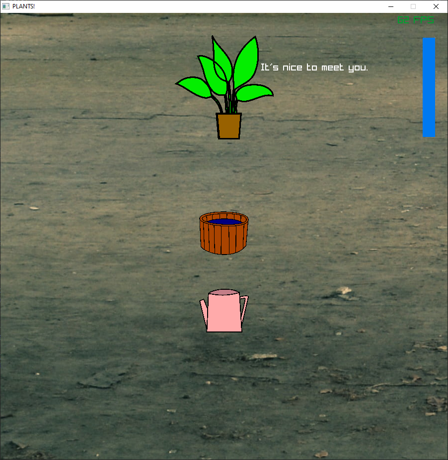

# Archie's raylib 5K gamejam Game

## A Simple Plant Game

### Description

Keep your plants watered and happy!

### Features

 - Plants
 - Plants
 - Plants

### Controls

Keyboard:
 - WASD to move
 - Q to water plant and refill water

### Developers

 - Archie Atkinson - Everything but Music
 - Andrew Atkinson - Music

### Links

 - itch.io Release: $(itch.io Game Page)

### Running the Game
Requires:
- [Emscripten](https://emscripten.org/docs/getting_started/downloads.html)
- CMake
- GCC
- sed (Comes with mingw)

#### Web
- `emcmake cmake -S . -B build_web -G Ninja -DPLATFORM=Web`
- `cmake --build build_web`
- `emrun build_webGameJam.html`

#### Web
- `cmake -S . -B build -G Ninja -DPLATFORM=Desktop`
- `cmake --build build`
- `./build/GameJam.exe`

*Copyright (c) 2022 Archie Atkinson*